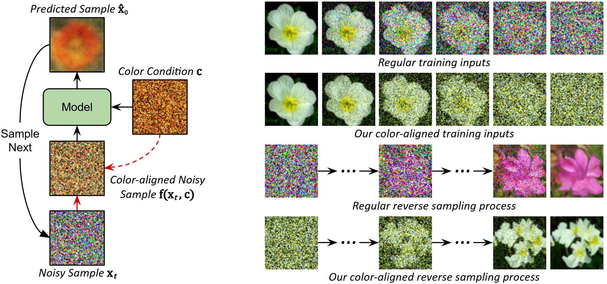

# Color Alignment in Diffusion [CVPR 2025]
Official Github repository for paper:
<p align="center">
  <a href="https://arxiv.org/abs/2503.06746"><i><b>Color Alignment in Diffusion</b></i></a>
<br>
  <a href="https://scholar.google.com/citations?user=LAUhTjAAAAAJ"><i>Ka Chun Shum<sup>1</sup></i></a>,
  <a href="https://sonhua.github.io/"><i>Binh-Son Hua<sup>2</sup></i></a>, 
  <a href="https://ducthanhnguyen.weebly.com/"><i>Duc Thanh Nguyen<sup>3</sup></i></a>, 
  <a href="https://saikit.org/index.html"><i>Sai-Kit Yeung<sup>1</sup></i></a>
<br>
  <i><sup>1</sup>Hong Kong University of Science and Technology</i>&nbsp&nbsp <i><sup>2</sup>Trinity College Dublin</i>&nbsp&nbsp <i><sup>3</sup>Deakin University</i>
<br>
</p>

 <a href='https://arxiv.org/abs/2503.06746'></a> &nbsp;
 <a href='https://kcshum.github.io/color-alignment-in-diffusion-homepage/'></a> &nbsp;
 [![CC BY-NC-SA 4.0][cc-by-nc-sa-shield]][cc-by-nc-sa] &nbsp;


[cc-by-nc-sa]: http://creativecommons.org/licenses/by-nc-sa/4.0/
[cc-by-nc-sa-image]: https://licensebuttons.net/l/by-nc-sa/4.0/88x31.png
[cc-by-nc-sa-shield]: https://img.shields.io/badge/License-CC%20BY--NC--SA%204.0-lightgrey.svg

<br>
  
<br>
Color alignment in Diffusion maps the diffused colors to conditional colors across diffusion steps, enabling a continuous pathway for data synthesis towards a target color pattern while preserving the creative power of diffusion models.

# Environment
You may follow the corresponding documentation to install [Pytorch](https://pytorch.org/get-started/locally/),
[Pytorch3D](https://pytorch3d.org/#quickstart),
Hugging Face's [Accelerate](https://huggingface.co/docs/accelerate/basic_tutorials/install), 
[Diffusers](https://huggingface.co/docs/diffusers/installation), 
[Transformers](https://huggingface.co/docs/transformers/installation), and Weights & Biases ([wandb](https://docs.wandb.ai/quickstart/)) for visualization.

# Training
### 1. Fine-tune a pre-trained text-to-image model with color alignment in latent space
The command below fine-tunes our color alignment on [stable-diffusion-v1-5](https://huggingface.co/stable-diffusion-v1-5/stable-diffusion-v1-5) at resolution 512:
```
sh AlignedDiffusion_Finetune_Train.sh
```
You may check the available arguments in the code.
We provide our fine-tuned weights [here](https://drive.google.com/file/d/1I4zPlQ-TZdvNMR2FYFa-2t78qFDNkBmL/view?usp=sharing) if you would like to use them for testing or to resume training.

### 2. Re-train a simple U-Net with color alignment in RGB space
The command below trains on a simple dataset using a lighter network at resolution 64:
```
sh AlignedDiffusion_Retrain_Train.sh
```

# Testing
### 1. Test the in-the-wild image conditions with our fine-tuned model
```
sh AlignedDiffusion_Finetune_Test_InTheWild.sh
```

### 2. Test the manual-drawing image conditions with our fine-tuned model
```
sh AlignedDiffusion_Finetune_Test_ManualDrawing.sh
```

### 3. Test our zero-shot approximation
```
sh AlignedDiffusion_Zeroshot_Test_InTheWild.sh
sh AlignedDiffusion_Zeroshot_Test_ManualDrawing.sh
```

# Acknowledgement
This code is built upon [Hugging Face's diffusion implementation](https://github.com/huggingface/diffusers/blob/main/examples/unconditional_image_generation/train_unconditional.py).
We thank them for their excellent work!